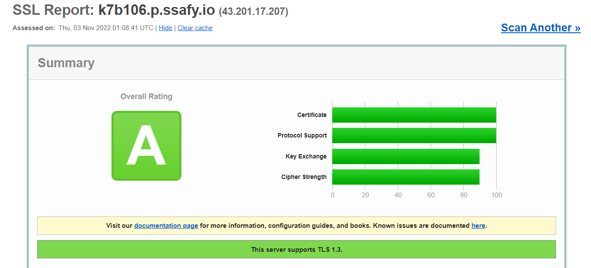

# 포트 메뉴얼

---

# MySQL 설치

<aside>
🔑 **MySQL(version : 8.0.31)**

URL : http://k7b106.p.ssafy.io:3306

관리자 ID : root

관리자 PW : B106admin!

유저 ID : da_ta

유저 PW : B106user@

</aside>

### MySQL Image Pull

```bash
docker pull mysql:8.0.31
```

### 볼륨 폴더 생성

```bash
sudo mkdir /opt/lib/mysql
```

### MySQL Container 실행

```bash
docker run --name mysql -e MYSQL_ROOT_PASSWORD=b106admin! -v /opt/lib/mysql:/var/lib/mysql -d -p 3306:3306 mysql:8.0.31
```

### MySQL Container 접속

```bash
docker exec -it  [컨테이너 명] /bin/bash
```

### MySQL 유저 생성 및 권한 부여

```bash
# mysql 접속
mysql -u root -p

# root 계정 비밀번호 변경
alter user 'root'@'localhost' identified with mysql_native_password by 'new password';
flush privileges;

# user 생성 및 권한 부여
create user '[username]'@'%' identified by '[password]';
grant all privileges on *.* to '[username]'@'%' with grant option;
flush privileges;
```

---

# Redis 설치

<aside>
🔑 URL : http://k7b106.p.ssafy.io:6379

Auth : B106ssafy

User ID : da_ta

User PW : passB106user

</aside>

### Redis Image Pull

```bash
docker image pull redis
```

### Redis 컨테이너 실행

```bash
docker run --name redis -p 6379:6379 --network redis-net -v /etc/ubuntu/redisDir -d redis:latest redis-server --appendonly yes --requirepass B106ssafy
```

### Redis-cli 접속

```bash
docker run -it --network redis-net --rm redis redis-cli -h redis 
```

### Redis-cli Auth 접속

```bash
auth B106ssafy
```

### ACL User 설정

```bash
ACL SETUSER da_ta on >passB106user allkeys allcommands
```

### ACL 목록 확인

```bash
ACL list
```

---

# Nginx 설정

### Nginx 다운로드

```bash
apt install nginx
# 버전 확인
nginx -v
```

### letsencrypt 다운로드

```bash
sudo apt-get install letsencrypt
sudo systemctl stop nginx
sudo letsencrypt certonly --standalone -d k7b106.p.ssafy.io
```

### SSL 인증완료



### config 설정

path : /etc/nginx/sites-available/

```bash
server {
    server_name k7b106.p.ssafy.io;

    location / {
        proxy_pass http://localhost:3000;
        proxy_redirect off;
        charset utf-8;

        proxy_set_header X-Real-IP $remote_addr;
        proxy_set_header X-Forwarded-For $proxy_add_x_forwarded_for;
        proxy_set_header Host $http_host;
        proxy_set_header X-Forwarded-Proto $scheme;
        proxy_set_header X-NginX-Proxy true;
    }

    location /api {
        proxy_pass http://localhost:8080/api;
        proxy_redirect off;
        charset utf-8;

        proxy_set_header X-Real-IP $remote_addr;
        proxy_set_header X-Forwarded-For $proxy_add_x_forwarded_for;
        proxy_set_header Host $http_host;
        proxy_set_header X-Forwarded-Proto $scheme;
        proxy_set_header X-NginX-Proxy true;
    }

    listen 443 ssl; # managed by Certbot
    ssl_certificate /etc/letsencrypt/live/k7b106.p.ssafy.io/fullchain.pem; # managed by Certbot
    ssl_certificate_key /etc/letsencrypt/live/k7b106.p.ssafy.io/privkey.pem; # managed by Certbot
    # include /etc/letsencrypt/options-ssl-nginx.conf; # managed by Certbot
    # ssl_dhparam /etc/letsencrypt/ssl-dhparams.pem; # managed by Certbot
}
server {

    if ($host = k7b106.p.ssafy.io) {
        return 301 https://k7b106.p.ssafy.io$request_uri;
    } # managed by Certbot

    listen 80;
    server_name k7b106.p.ssafy.io;

    return 404; # managed by Certbot
}
```

### 설정 파일 연결

```bash
sudo ln -s /etc/nginx/sites-available/[파일명] /etc/nginx/sites-enabled/[파일명]
sudo nginx -t
sudo systemctl restart nginx
```

---

# Docker 설치

### docker 설치 전 요구되는 OS

현재 docker 공식 문서에서 지원하는 OS이다. 설치하기 전 OS가 해당되는지 확인 바란다.

- Ubuntu Impish 21.10
- Ubuntu Hirsute 21.04
- Ubuntu Focal 20.04 (LTS)
- Ubuntu Bionic 18.04 (LTS)

### Repository를 이용하여 설치하기

1. 기본적인 패키지들이 최신 버전인지 확인하기

```bash
$ sudo apt-get update && upgrade
```

2. apt가 HTTPS를 통해 repository를 이용하는 것을 허용할 수 있도록 해주는 패키지들 설치

```bash
$ sudo apt-get install \
    ca-certificates \
    curl \
    gnupg \
    lsb-release
```

3. Docker 공식 GPG key 추가

```bash
$ curl -fsSL https://download.docker.com/linux/ubuntu/gpg | sudo gpg --dearmor -o /usr/share/keyrings/docker-archive-keyring.gpg
```

4. Docker repository 등록

```bash
$ echo \
  "deb [arch=$(dpkg --print-architecture) signed-by=/usr/share/keyrings/docker-archive-keyring.gpg] https://download.docker.com/linux/ubuntu \
  $(lsb_release -cs) stable" | sudo tee /etc/apt/sources.list.d/docker.list > /dev/null
```

5. Docker 설치

```bash
$ sudo apt-get update
$ sudo apt-get install docker-ce docker-ce-cli containerd.io
```

여기까지 진행했다면 docker의 설치는 끝났다. 다음 명령어를 통해 설치된 docker를 확인해보자.

```bash
$ sudo docker version
```

---

### ubuntu 환경에서 sudo 없이 docker 명령어 사용하기

```bash
$ sudo usermod -aG docker $USER
```

---

# Jenkins 설치

<aside>
💡 URL : http://k7b106.p.ssafy.io:9090

ID : B106

PW : B106admin!

</aside>

### **도커허브로 부터 jenkins/jenkins:lts 이미지 pull**

```bash
docker pull jenkins/jenkins:lts
```

### 젠킨스 컨테이너 실행

```bash
docker run --name jenkins -d -p 9090:8080 -p 50000:50000 -v /jenkins:/var/jenkins_home -v /usr/bin/docker:/usr/bin/docker -v /var/run/docker.sock:/var/run/docker.sock -v /sonarqube:/sonarqube -u root jenkins2
```

### **도커 컨테이너의 실행 상태 확인**

```bash
docker ps
```

# Jenkins 설정 - Frontend

### Mattermost 알림 - 빌드 전

```bash
REQUEST="curl -i \
        -X POST \
        -H 'Content-Type: application/json' \
        -d '{ \
        		\"icon_url\": \"\", \
        		\"attachments\": [{ \
                        \"author_name\": \"Jenkins\", \
                        \"author_icon\": \"https://miro.medium.com/max/750/0*cASzy09ehdIz5bGB.png\", \
                        \"author_link\": \"$BUILD_URL\", \
                        \"title\": \"Frontend 빌드 시작\", \
                        \"text\": \"빌드 중\", \
                         \"fields\": [{ \
                                  		\"short\":true, \
                                  		\"title\":\"Branch\", \
                                  		\"value\":\"$GIT_BRANCH\" \
                                  }] \
                      }] \
                }] \
        }'\
        https://meeting.ssafy.com/hooks/ifx3wgizw3g95mc1h9oq6t65bw"
eval $REQUEST
```

### Mattermost 알림 - 빌드 후

```bash
REQUEST="curl -i \
        -X POST \
        -H 'Content-Type: application/json' \
        -d '{ \
                \"icon_url\": \" \", \
                \"attachments\": [{ \
                        \"author_name\": \"Jenkins\", \
                        \"author_icon\": \"https://miro.medium.com/max/750/0*cASzy09ehdIz5bGB.png\", \
                        \"author_link\": \"$BUILD_URL\", \
                        \"title\": \"Frontend 빌드 성공\", \
                        \"title_link\": \"https://k7b106.p.ssafy.io\", \
                        \"fields\": [{ \
                                  		\"short\":true, \
                                  		\"title\":\"Branch\", \
                                  		\"value\":\"$GIT_BRANCH\" \
                                  }, \
                                  { \
                                      	\"short\":false, \
                                      	\"title\":\"빌드 결과\", \
                                      	\"value\":\"$BUILD_URL\" \
                                  }] \
                      }] \
        }'\
        https://meeting.ssafy.com/hooks/ifx3wgizw3g95mc1h9oq6t65bw"
eval $REQUEST
```

### Shell 스크립트

```bash
docker image prune -a --force
mkdir -p /var/jenkins_home/images_tar
cd /var/jenkins_home/workspace/Da_Ta_Project_Front/frontend
docker build -t react .
docker save react > /var/jenkins_home/images_tar/react.tar
ls /var/jenkins_home/images_tar
```

### SSH 스크립트

```bash
if (sudo docker ps | grep "react"); then sudo docker stop react; fi
sudo docker load < /jenkins/images_tar/react.tar
sudo docker run -it -d --rm -p 3000:3000 --name react react
echo "Run Front"
```

### Dockerfile

```bash
FROM node:16.17.0 as build-stage
WORKDIR /var/jenkins_home/workspace/Da_Ta_Project_Front/frontend
COPY package*.json ./
RUN npm install
COPY . .
RUN npm run build
CMD ["npm","run","start"]
```

# Jenkins 설정 - Backend

### Mattermost 알림 - 빌드 전

```bash
REQUEST="curl -i \
        -X POST \
        -H 'Content-Type: application/json' \
        -d '{ \
        		\"attachments\": [{ \
                        \"author_name\": \"Jenkins\", \
                        \"author_link\": \"$BUILD_URL\", \
                        \"title\": \"Backend 빌드 시작\", \
                        \"text\": \"빌드 중\", \
                         \"fields\": [{ \
                                  		\"short\":true, \
                                  		\"title\":\"Branch\", \
                                  		\"value\":\"$GIT_BRANCH\" \
                                  }] \
                      }] \
                }] \
        }'\
        https://meeting.ssafy.com/hooks/ifx3wgizw3g95mc1h9oq6t65bw"
eval $REQUEST
```

### Mattermost 알림 - 빌드 후

```bash
REQUEST="curl -i \
        -X POST \
        -H 'Content-Type: application/json' \
        -d '{ \
                \"attachments\": [{ \
                        \"author_name\": \"Jenkins\", \
                        \"author_link\": \"$BUILD_URL\", \
                        \"title\": \"Backend 빌드 성공\", \
                        \"title_link\": \"https://k7b106.p.ssafy.io\", \
                        \"fields\": [{ \
                                  		\"short\":true, \
                                  		\"title\":\"Branch\", \
                                  		\"value\":\"$GIT_BRANCH\" \
                                  }, \
                                  { \
                                      	\"short\":true, \
                                      	\"title\":\"빌드 결과\", \
                                      	\"value\":\"$BUILD_URL\" \
                                  }] \
                      }] \
        }'\
        https://meeting.ssafy.com/hooks/ifx3wgizw3g95mc1h9oq6t65bw"
eval $REQUEST
```

### Shell 스크립트

```bash
docker ps
docker image prune -a --force
mkdir -p /var/jenkins_home/images_tar
cd /var/jenkins_home/workspace/Da_Ta_Project/backend/da_ta/
docker build -t springboot .
docker save springboot > /var/jenkins_home/images_tar/springboot.tar
ls /var/jenkins_home/images_tar
```

### SSH 스크립트

```bash
if (sudo docker ps | grep "springboot"); then sudo docker stop springboot; fi
sudo docker load < /jenkins/images_tar/springboot.tar
sudo docker run -it -d --rm -p 8080:8080 -v /home/ubuntu:/home/ubuntu --name springboot springboot
echo "Run Back"
```

### Dockerfile

```bash
FROM openjdk:8 AS builder
COPY gradlew .
COPY gradle gradle
COPY build.gradle .
COPY settings.gradle .
COPY src src
RUN chmod +x /gradlew
RUN ./gradlew bootJar
FROM openjdk:8
COPY --from=builder build/libs/da_ta-0.0.1-SNAPSHOT.jar app.jar
ARG ENVIRONMENT
ENV GOOGLE_APPLICATION_CREDENTIALS=/home/ubuntu/da-ta-368201-c65a6e7dc0b9.json
ENTRYPOINT ["java","-jar","/app.jar"]
```

---

# SonarQube 설치

<aside>
🔑 URL : http://k7b106.p.ssafy.io:9000

ID : admin

PW : B106admin!

</aside>

### Sonarqube image pull

```bash
docker pull sonarqube
```

### sonarqube 파라미터

[Analysis Parameters](https://docs.sonarqube.org/latest/analysis/analysis-parameters/)

### Sonarqube 컨테이너 실행

```bash
docker run -d --name sonarqube -p 9000:9000 -v /sonarqube:/sonarqube sonarqube
```

# SonarQube 설정 - Frontend

### Jenkinsfile

```bash
node {
  stage('SCM') {
    checkout scm
  }
  stage('SonarQube analysis') {
    def scannerHome = tool name: 'SonarQube_Scanner';
    withSonarQubeEnv() {
      nodejs(nodeJSInstallationName: 'nodejs') {
        sh "cd ${scannerHome}/bin/"
        sh "ls -la /sonarqube"
        sh "chmod +x /sonarqube/front_script.sh"
        sh "/sonarqube/front_script.sh"
      }
    }
  }
}
```

### sh 스크립트

```bash
#!/bin/bash
  
/var/jenkins_home/tools/hudson.plugins.sonar.SonarRunnerInstallation/SonarQube_Scanner/bin/sonar-scanner -X -Dsonar.login='admin' -Dsonar.password='B106admin!'
```

# SonarQube 설정 - Backend

### Jenkinsfile

```bash
node {
  stage('SCM') {
    checkout scm
  }
  stage('SonarQube Analysis') {
    withSonarQubeEnv() {
      sh "chmod +x /sonarqube/jenkins_script.sh"
      sh "/sonarqube/jenkins_script.sh"
    }
  }
}
```

### sh 스크립트

```bash
#!/bin/bash
  
cd ./backend/da_ta/
chmod +x ./gradlew
./gradlew sonarqube -Dsonar.login='admin' -Dsonar.password='B106admin!' -Dsonar.projectKey='s07-final_S07P31B106_AYRlkrjP_ZYdU9VosQ9V'
```